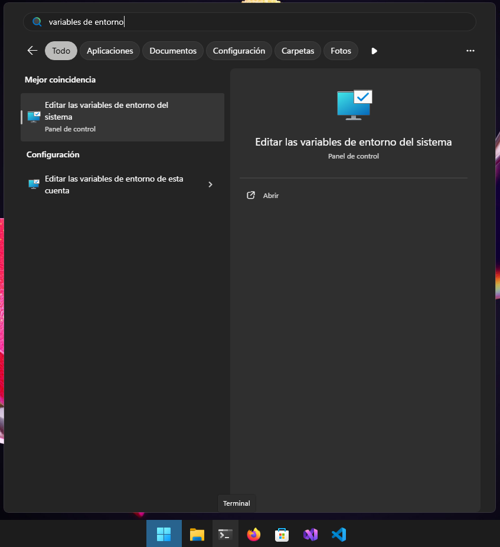
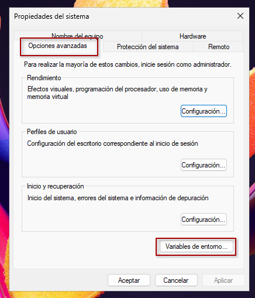
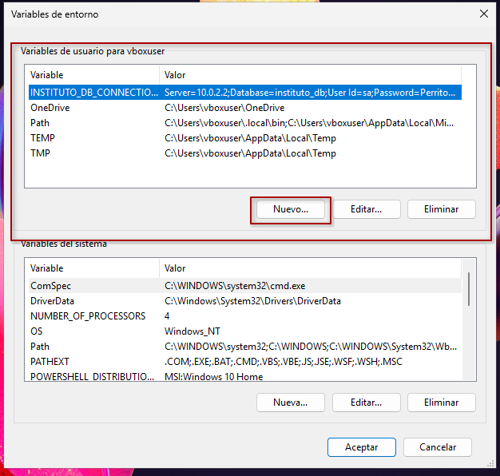
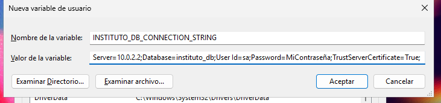

# ISFDyT93 - Sistema de Gestión Académica

Proyecto desarrollado para la gestión de procesos internos del Instituto Superior de Formación Docente y Técnica N° 93.

> [!NOTE]
>
> TODO: Agregar descripción detallada del proyecto, funcionalidades, tecnologías utilizadas, etc.

---

# Configuración del proyecto

## Variables de entorno

Se necesita establecer la variable de entorno `INSTITUTO_DB_CONNECTION_STRING` con la cadena de conexión a la base de datos para que la aplicación pueda conectarse a ella.

### Ejemplos de cadena de conexión

#### Cadena de conexión para instancia local de SQL Server

```js
Server=Data Source=DEV\\NombreInstancia;Database=instituto_db;TrustServerCertificate=True;Integrated Security=True
```

#### Cadena de conexión para instancia remota de SQL Server

```js
Server=myServerAddress;Database=myDataBase;User Id=myUsername;Password=myPassword;TrustServerCertificate=True;
```

### Configurar variable de entorno en Windows

1. Buscar "Variables de entorno" en el menú de inicio y seleccionar "Editar las variables de entorno del sistema".

    

2. En la ventana "Opciones avanzadas", hacer clic en "Variables de entorno".

    

3. En la sección "Variables del usuario", hacer clic en "Nueva..." para agregar una nueva variable de entorno.

    
4. Ingresar el nombre de la variable de entorno `INSTITUTO_DB_CONNECTION_STRING` y su valor correspondiente (ver: [cadena de conexión](./docs/images/variables-de-entorno/#ejemplos-de-cadena-de-conexión)).

    

5. Hacer clic en "Aceptar" para guardar la variable de entorno.

6. Reiniciar cualquier terminal, Visual Studio o aplicación que necesite acceder a la variable de entorno para que los cambios surtan efecto.
